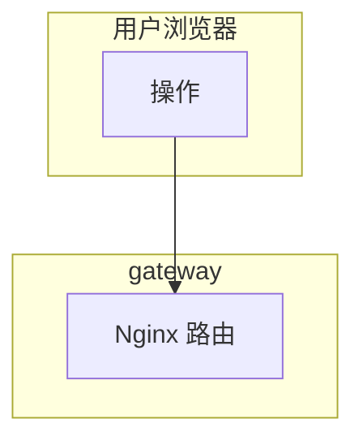
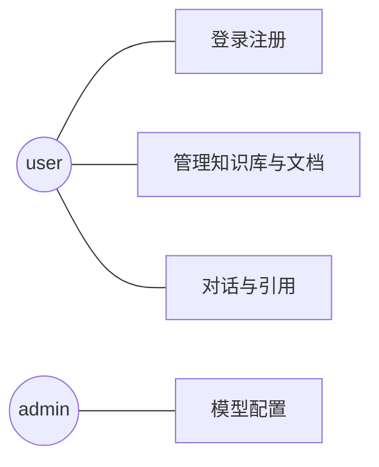
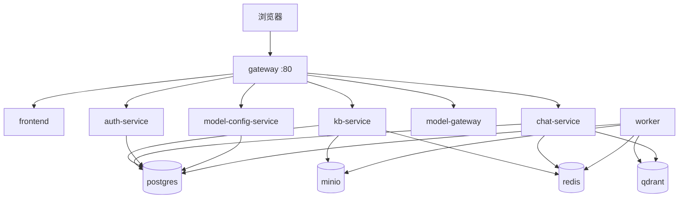
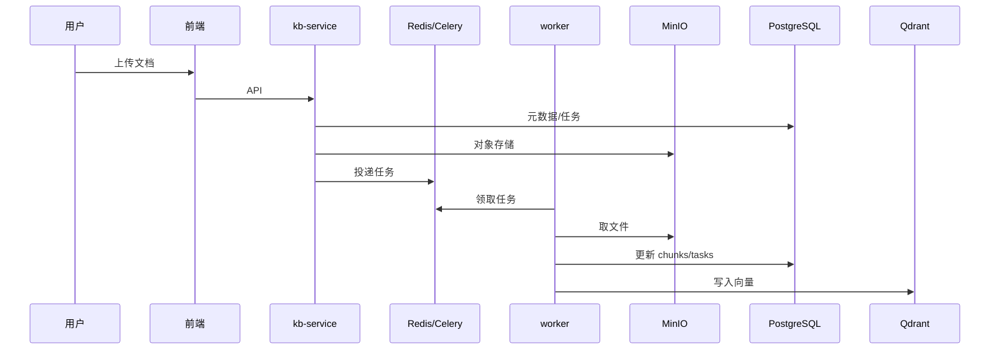
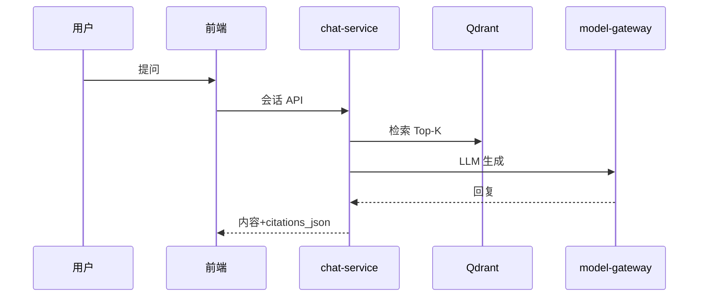

# 第3–7章制图与 Mermaid 模板

## 通用约定

- 图中服务名与 `docker-compose.yml` 的 `services` 键一致（如 `kb-service`）。
- 数据库写 `PostgreSQL`，向量库写 `Qdrant`，对象存储写 `MinIO`，队列写 `Redis + Celery worker`。
- 用户角色仅 `admin`、`user`（与 `users.role` CHECK 一致）。

## 3.1 业务流程图（Mermaid flowchart 示例骨架）

按真实流程补全：`frontend` → `gateway` → `auth-service` / `kb-service` / `chat-service`；异步分支到 `worker` → `minio` / `postgres` / `qdrant`。

## 3.2 用例图

Word 中常用 **UML 用例图**；Mermaid 的 `graph` 可简化为「角色—用例」二分图：

具体用例名与页面/接口对齐（来自 `frontend/src/pages` 与 `api.ts`）。

## 4.1 部署架构图

端口以论文中**实际映射**为准（如 Postgres `5433:5432`）。

## 4.3 时序图模板

### 文档摄取（逻辑）

### 问答与引用（逻辑）

细节需对照 `services/chat-service/app/main.py` 中实际调用顺序（是否 rerank、是否 hybrid）。

## 4.4 E-R 图注意

- `documents.knowledge_base_id` 与 `knowledge_bases` 多对一；`chunks` 与 `documents` 多对一。
- `conversations` 依赖 `modes`；`messages` 依赖 `conversations`。
- `ingestion_tasks` 与 `documents` 多对一。
- `faq_entries` 可选挂 `knowledge_bases`。
- `entities` 关联 `documents` / `chunks`（网络安全实体抽取扩展）。

ER 图在 Mermaid 中可用 `erDiagram`（字段多时可只画实体与关系，字段放表 4.4.2）。

## 6 章测试表（Markdown 粘贴 Word 前可用）

| 用例编号 | 模块 | 前置条件 | 步骤 | 预期结果 | 实际结果 | 结论 |
|----------|------|----------|------|----------|----------|------|
| TC-001 | 认证 | … | … | … | … | 通过 |

## 安全测试示例行（勿照抄，按实测填）

| 编号 | 项 | 方法 | 预期 |
|------|-----|------|------|
| SEC-001 | 未带 Token 访问受保护 API | curl 无 Authorization | 401 |
| SEC-002 | SQL 注入 | 在搜索/登录框输入典型 payload | 拒绝或转义，无报错泄露 |
